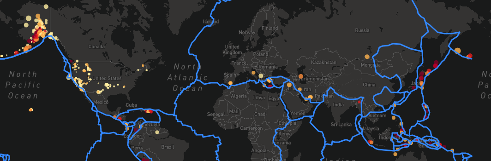

[View my GitHub Portfolio](https://joekell.github.io/)

# Leaflet/Mapbox Challenge - Layered Earthquake Map

## Summary

In this project, I built a layered world map that displays all earthquakes from the last 7 days by magnitude and depth as well as the borders of the Earth's tectonic plates.

### Using the Final Application
Since the API is not free to use, the final application is not publicly available. The page opens in dark mode with both earthquakes and tectonic plate borders visible:

Clicking on any of the earthquakes will show the name of the earthquake which is uaully just a description of the location and the time that it happened. In the bottom right corner of the screen is a legend to help the user understand the depth of the earthquake. In the upper right corner of the screen is a control for the user to choose which map layer is visible and whether or not the earthquakes or tectonic plates are visible. 

## Tools
These are the tools, techniques, and resources used in this project.

* Javascript, leaflet, and Mapbox are used to generate the map

* HTML is used for the framework of the page and CSS for styling

* D3 JSON and Leaflet geoJSON are used to load in the data

### About the Data

The earthquake data comes from the 'All Earthquakes from the Past 7 Days' data set on the [USGS GeoJSON Feed](http://earthquake.usgs.gov/earthquakes/feed/v1.0/geojson.php) page. The tectonic plate borders geoJSON comes from <https://github.com/fraxen/tectonicplates>.

## Project Steps

### Step 1: Static Page Elements
The page is quite simple, 1 div with the map in it. Everything else is javascript.

### Step 2: Map Code

This is the code at the root of the map, passing in the center coordinates and initial zoom value as well as setting which layers show up on page load.

When zooming out further, it is possible to fully appreciate the vastness of the tectonic plates and how many earthquakes happen in 1 week.

### Step 3: Control 

With a control users are able to interact with the map and view it in the way that suits their needs.

The code for this is slightly cleaner when creating each layer as a variable. Each of the modes (dark, street, etc.) is a variable and then those variables are stored in baseMaps. The earthquakes and plate borders are stored in overlayMaps.

### Step 4: Earthquakes 

The plotting of the earthquakes on the map needed to show 4 pieces of information (more when clicked): latitude, longitude, magnitude, and depth. Lat and Long are represented by where the center of the circle is. The color shows the depth and the size of the marker reflects the magnitude of the earthquake

To determine which color a circle will be we use a switch statement and a basic gradient of colors. The size of the circle is a linear relation to the magnitude of the earthquake.

### Step 5: Legend 

After looking into what the max and min depths would appear as I was able to determine categories and colors that will correspond on the map.

The legend div is edited as HTML and gets the corresponding font colors from the CSS.

### Step 6: Loading Data

Using D3 JSON and leaflet geoJSON it is easy to create the tectonic plates overlay.
